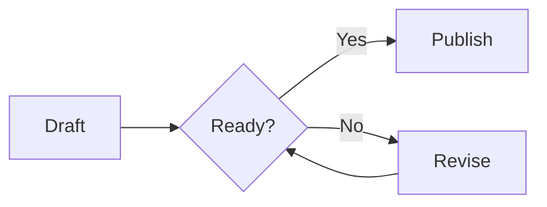
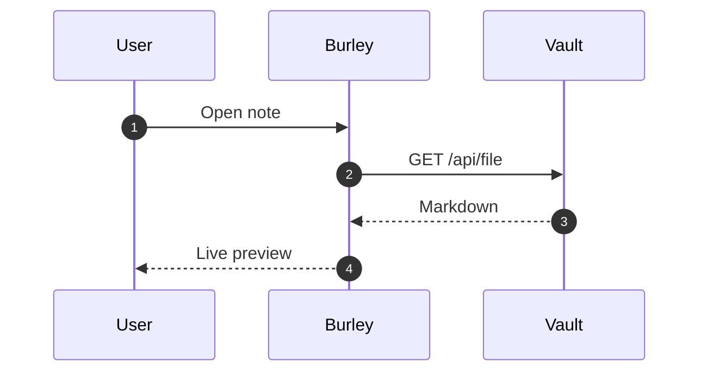
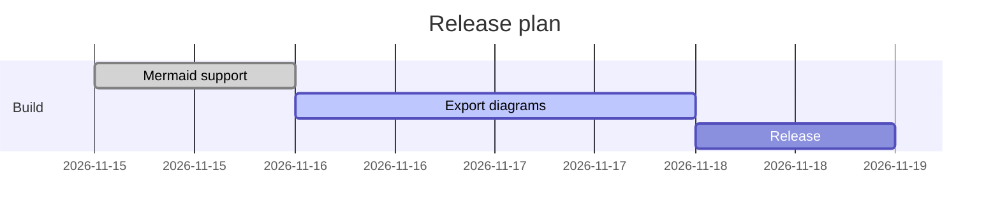

# Mermaid diagrams

```mermaid
flowchart LR
  A[Draft] --> B{Ready?}
  B -->|Yes| C[Publish]
  B -->|No| D[Revise]
  D --> B
```

```mermaid
sequenceDiagram
  autonumber
  User->>Burley: Open note
  Burley->>Vault: GET /api/file
  Vault-->>Burley: Markdown
  Burley-->>User: Live preview
```

```mermaid
gantt
  title Release plan
  dateFormat  YYYY-MM-DD
  section Build
  Mermaid support     :done,    m1, 2026-11-15, 1d
  Export diagrams     :active,  m2, 2026-11-16, 2d
  Release             :         m3, after m2, 1d
```

Diagrams re-render when you switch UI themes, and the **⤢** button opens them
in the figure viewer.
